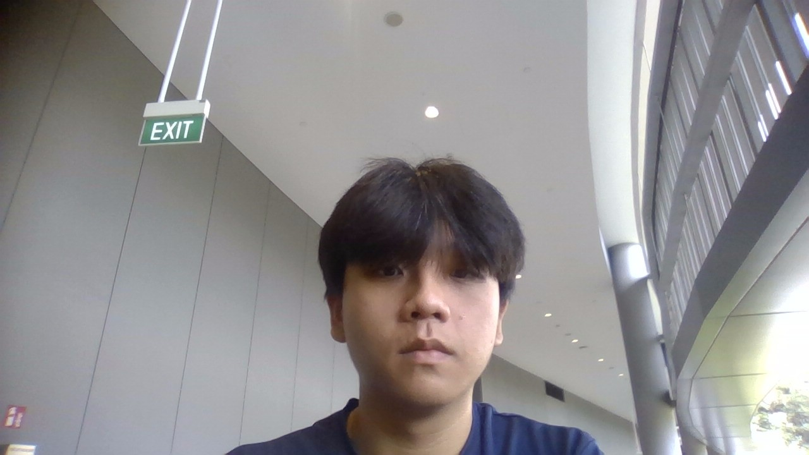
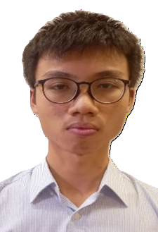
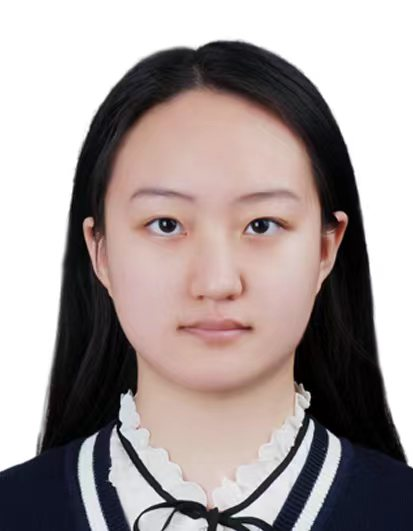
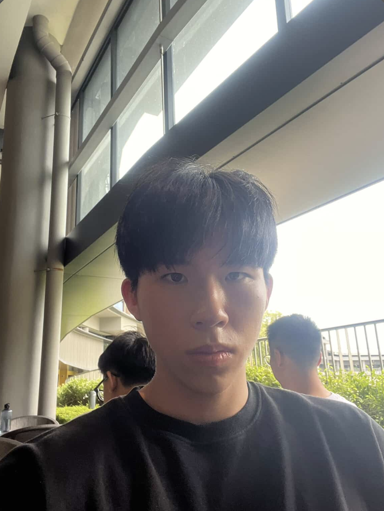

# About Us

We are a team based in the [School of Computing, National University of Singapore](http://www.comp.nus.edu.sg).

You can reach us at the email `seer[at]comp.nus.edu.sg`

## Project team
### Edbert

[[github](https://github.com/ebt-wu)]
[[portfolio](team/johndoe.md)]

* Role: Team Lead and Integration
* Responsibilities: Overall project coordination and versioning of the code, maintaining the code repository, integrating various parts of the software to create a whole

### Tan Wei Xian

[[homepage](http://www.comp.nus.edu.sg/~damithch)]
[[github](https://github.com/weixianuni)]
[[portfolio](team/johndoe.md)]

* Role: Deliverables and Deadlines
* Responsibilities: Ensure project deliverables are done on time and in the right format.

### Loh Zhi Qin

[[github](https://github.com/lohzq88)]

* Role: Developer
* Responsibilities: Documentation, Code Quality

### Da Jiaxuan

[[github](https://github.com/MousseDm)]

* Role: Developer
* Responsibility: Code quality, Testing

### Joseph Kwok

[[github](http://github.com/josephkwok001)]
[[portfolio](team/johndoe.md)]

* Role: Developer
* Responsibilities: Deliverables and deadlines + Integration + Code Quality
