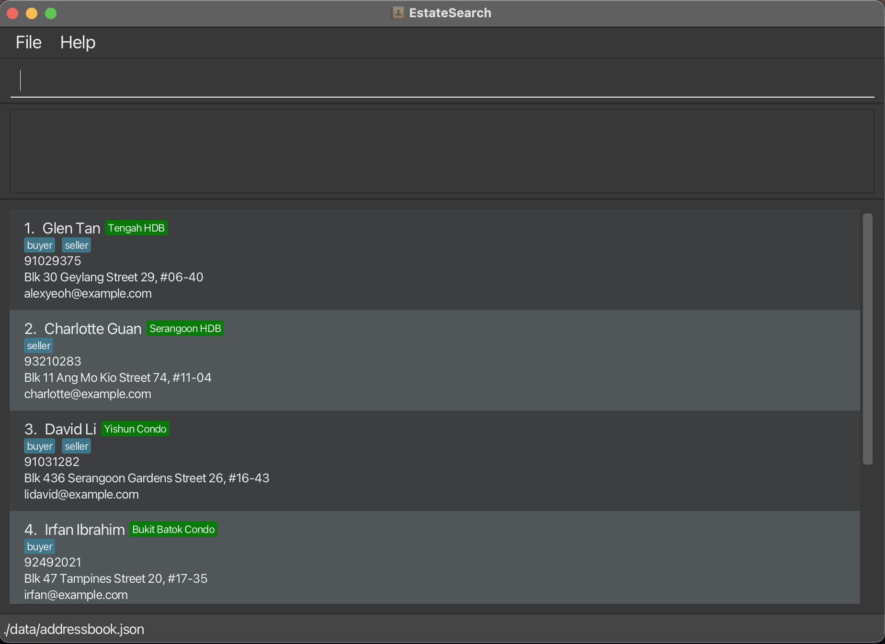
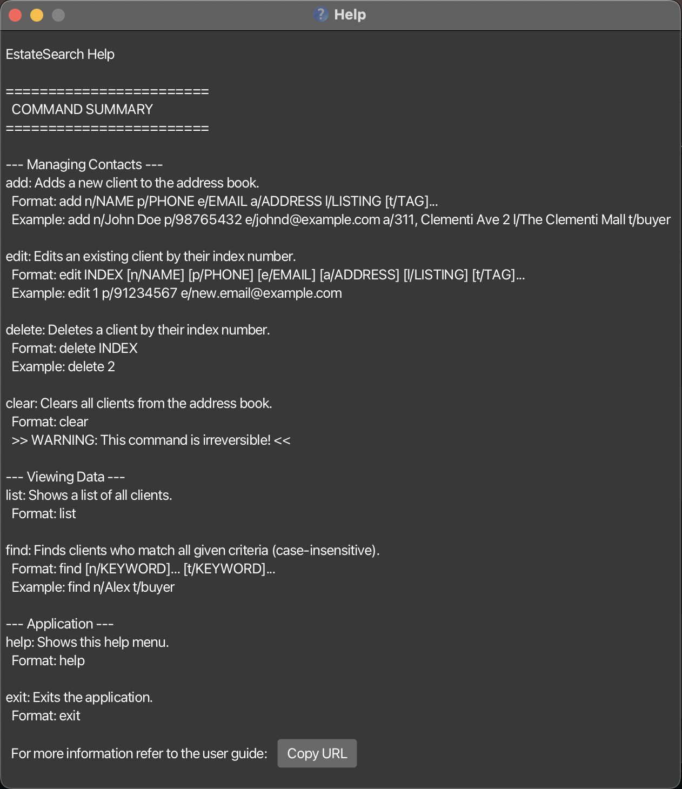
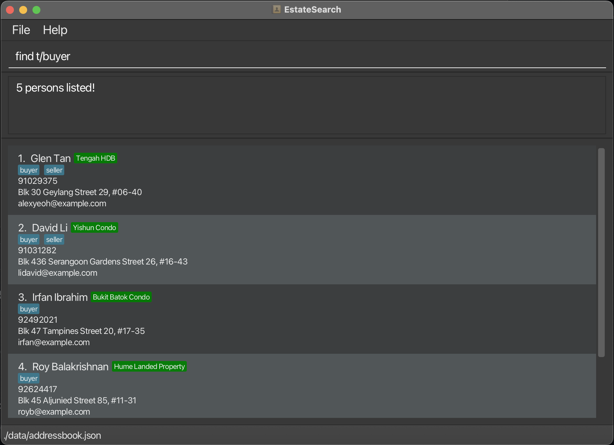

# Welcome to EstateSearch!

We're excited to help you **streamline your real estate client management**! This user guide contains everything you need to know to get started with **EstateSearch**, from adding your first client and property to mastering all of its powerful features. Let's dive in!
<!-- * Table of Contents -->
<page-nav-print />

--------------------------------------------------------------------------------------------------------------------

## Getting Started

1. Ensure you have Java `17` or above installed in your Computer. 
   **Mac users:** Ensure you have the precise JDK version prescribed [here](https://se-education.org/guides/tutorials/javaInstallationMac.html).

<box type="tip" seamless>

**Tip**: 
Finding Your Command-Line Application:

* On Windows: Open the **Start Menu** and search for **Command Prompt** or **PowerShell**.

* On macOS: Open Spotlight (Cmd + Space) and search for **Terminal**.

</box>

2. Download the latest `.jar` file from [here](https://github.com/AY2526S1-CS2103T-W12-4/tp/releases/tag/v1.3).

3. Copy the file to the folder you want to use as the _home folder_ for your EstateSearch application.

4. Open a command terminal, `cd` into the folder you put the jar file in, and use the `java -jar estatesearch.jar` command to run the application. 
   A GUI similar to the below should appear in a few seconds. 
    

5. Type a command in the command box and press the <kbd>ENTER</kbd> key to execute it. e.g. typing **`help`** and pressing the <kbd>ENTER</kbd> key will open the help window. 
   Some example commands you can try:

    * `list` : Lists all contacts.

    * `add n/John Doe p/98765432 e/johnd@example.com a/John street, block 123, #01-01` : Adds a contact named `John Doe` to Estate Search.

    * `delete 3` : Deletes the 3rd contact shown in the current list.

    * `clear` : Deletes all contacts.

    * `exit` : Exits the app.

6. Refer to the [Features](#features) below for details of each command.

<box type="info" seamless>
The application contains sample contacts. To remove them, type <code>clear</code> and press <kbd>ENTER</kbd>.
</box>

--------------------------------------------------------------------------------------------------------------------

## EstateSearch Command Summary

Action     | Format, Examples
-----------|----------------------------------------------------------------------------------------------------------------------------------------------------------------------
**Add**    | `add n/NAME p/PHONE_NUMBER e/EMAIL a/ADDRESS [t/TAG]…​`   e.g., `add n/James Ho p/22224444 e/jamesho@example.com a/123, Clementi Rd, 1234665 t/client t/colleague`
**Clear**  | `clear`
**Delete** | `delete INDEX`  e.g., `delete 3`
**Edit**   | `edit INDEX [n/NAME] [p/PHONE_NUMBER] [e/EMAIL] [a/ADDRESS] [l/LISTING] [t/TAG]…​`  e.g.,`edit 2 n/James Lee e/jameslee@example.com`
**Find**   | `find n/NAME` or `find t/TAG`   e.g., `find n/James` `find t/client`
**List**   | `list`
**Help**   | `help`
**Export** | `export FILENAME`
**Exit**   | `exit`
**Add Property** | `addp n/NAME a/ADDRESS pr/PRICE`   e.g., `addp n/Sunshine Condo a/123, Sunshine Rd, 123456 pr/800000`
**Delete Property** | `deletep INDEX`  e.g., `deletep 3`
**Set Owned Property** | `setop i/INDEX n/PROPERTY_NAME`  e.g., `setop i/1 n/City Loft`
**Set Interested Property** | `setip i/INDEX n/PROPERTY_NAME`  e.g., `setip i/2 n/Sunshine Condo`

--------------------------------------------------------------------------------------------------------------------

## Features

<box type="info" seamless>

**Notes about the command format:** 

* Words in `UPPER_CASE` are the parameters to be supplied by the user. 
  e.g. in `add n/NAME`, `NAME` is a parameter which can be used as `add n/John Doe`.

* Items in square brackets are optional. 
  e.g `n/NAME [t/TAG]` can be used as `n/John Doe t/friend` or as `n/John Doe`.

* Items with `…`​ after them can be used multiple times including zero times. 
  e.g. `[t/TAG]…​` can be used as ` ` (i.e. 0 times), `t/friend`, `t/friend t/family` etc.

* Parameters can be in any order. 
  e.g. if the command specifies `n/NAME p/PHONE_NUMBER`, `p/PHONE_NUMBER n/NAME` is also acceptable.

* Extraneous parameters for commands that do not take in parameters (such as `help`, `list`, `exit` and `clear`) will be ignored. 
  e.g. if the command specifies `help 123`, it will be interpreted as `help`.

* If you are using a PDF version of this document, be careful when copying and pasting commands that span multiple lines as space characters surrounding line-breaks may be omitted when copied over to the application.
  </box>

### Viewing help : `help`

Shows a brief overview of the commands that are available as well as a link to the user guide page.

Format: `help`

<box type="info" seamless>

**Note:** The help menu will be opened in a separate window. You can close the help window without exiting the application.

</box>

### Adding a person: `add`

Adds a person to EstateSearch.

Format: `add n/NAME p/PHONE_NUMBER e/EMAIL a/ADDRESS [t/TAG]…​`

<box type="tip" seamless>

**Tip:** A person can have any number of tags (including 0)
</box>

Examples:
* `add n/John Doe p/98765432 e/johnd@example.com a/John street, block 123, #01-01`
* `add n/Betsy Crowe t/client e/betsycrowe@example.com a/Newgate Prison p/1234567 t/criminal`

### Adding a property: `addp`

Adds a property to EstateSearch.

Format: `addp n/NAME a/ADDRESS pr/PRICE`

Examples:
* `addp n/Sunshine Condo a/123, Sunshine Rd, 123456 pr/800000`
* `addp n/Ocean View HDB a/456, Ocean Ave, 654321 pr/1000000`

### Listing all persons : `list`

Shows a list of all persons in EstateSearch.

Format: `list`

### Editing a person : `edit`

Edits an existing person in EstateSearch.

Format: `edit INDEX [n/NAME] [p/PHONE] [e/EMAIL] [a/ADDRESS] [t/TAG]…​`

* Edits the person at the specified `INDEX`. The index refers to the index number shown in the displayed person list. The index **must be a positive integer** 1, 2, 3, …​
* At least one of the optional fields must be provided.
* Existing values will be updated to the input values.
* When editing tags, the existing tags of the person will be removed i.e adding of tags is not cumulative.
* You can remove all the person’s tags by typing `t/` without
  specifying any tags after it.

Examples:
*  `edit 1 p/91234567 e/johndoe@example.com` Edits the phone number and email address of the 1st person to be `91234567` and `johndoe@example.com` respectively.
*  `edit 2 n/Betsy Crower t/` Edits the name of the 2nd person to be `Betsy Crower` and clears all existing tags.

### Setting an owned Property for a Person : `setop`

Associates an existing property with the specified person as one of their owned properties.

Format: 'setop i/INDEX_OF_PERSON n/PROPERTY_NAME'

* Sets the owned property for the person at the specified 'INDEX'. The index refers to the index number shown in the displayed person list. The index **must be a positive integer** 1, 2, 3, …​ 
* 'PROPERTY_NAME' must match the name of a property that already exists in the app.
* If the given property name does not exist, an error message will be shown (e.g., Property not found: Marina Bay Apt 12F).
* Repeating the command with the same property for the same person has no effect (duplicates are ignored).

Examples:
* 'setop i/1 n/Marina Bay Apt 12F' — adds **Marina Bay Apt 12F** to the 1st person’s owned properties.
* list followed by 'setop i/3 n/Choa Chu Kang Landed Property' — adds **Choa Chu Kang Landed Property** to the 1st person’s owned properties.

### Setting an interested property for a Person : `setip`

Associates an existing property with the specified person as one of their interested properties.

Format: 'setip i/INDEX_OF_PERSON n/PROPERTY_NAME'

* Sets the interested property for the person at the specified 'INDEX'. The index refers to the index number shown in the displayed person list. The index **must be a positive integer** 1, 2, 3, …​ 
* 'PROPERTY_NAME' must match the name of a property that already exists in the app.
* If the given property name does not exist, an error message will be shown (e.g., Property not found: Marina Bay Apt 12F).
* Repeating the command with the same property for the same person has no effect (duplicates are ignored).

Examples:
* 'setip i/2 n/Sunshine Condo' — adds **Sunshine Condo** to the 2nd person’s interested properties.
* list followed by 'setip i/4 n/Ocean View HDB' — adds **Marina Bay Apt 12F** to the 1st person’s owned properties.

### Locating Persons by name: `find`

Finds contacts by either name or tag criteria.

Format: `find n/NAME or find t/TAG`

* The search is case-insensitive. e.g `hans` will match `Hans`
* The order of the keywords does not matter. e.g. `Hans Bo` will match `Bo Hans`
* Only the name and tag is searched.
* Only full words will be matched e.g. `Han` will not match `Hans`
* Persons matching at least one keyword will be returned (i.e. `OR` search).
  e.g. `Hans Bo` will return `Hans Gruber`, `Bo Yang`
*
Examples:
* `find t/client` returns all contacts tagged as clients
* `find n/John` returns all contacts whose names contain `John` (case-insensitive)

Examples:
* `find n/John` returns `john` and `John Doe`
* `find t/buyer` returns clients who have the tag `buyer`  
  

### Deleting a person : `delete`

Deletes the specified person from EstateSearch.

Format: `delete INDEX`

* Deletes the person at the specified `INDEX`.
* The index refers to the index number shown in the displayed person list.
* The index **must be a positive integer** 1, 2, 3, …​

Examples:
* `list` followed by `delete 2` deletes the 2nd person in EstateSearch.
* `find Betsy` followed by `delete 1` deletes the 1st person in the results of the `find` command.

### Deleting a property : `deletep`

Deletes the specified property from EstateSearch.

Format: `deletep INDEX`

* Deletes the property at the specified `INDEX`.
* The index refers to the index number shown in the property list.
* The index **must be a positive integer** 1, 2, 3, …​

Examples:
* `deletep 2` deletes the 2nd property in EstateSearch.

### Clearing all entries : `clear`

Clears all entries from EstateSearch.

Format: `clear`

<box type="warning" seamless>

**Caution:**
Clearing the data will delete all person and property entries permanently. There is no undo for this operation. 
Please execute this command only if you are sure you want to delete all data.
</box>

### Exporting data : `export`

Exports the current filtered contacts to a CSV file

Format: `export FILENAME`

* Exports all contacts currently shown in the filtered list to a CSV file.
* The CSV file is automatically saved with a .csv extension
* The FILENAME must not be empty and cannot contain only whitespace.

Examples:
* `export clients` creates a file named `clients.csv`
* `export my_contacts` creates a file named `my_contacts.csv`

<box type="tip" seamless>

The generated CSV file can be found at `[JAR file location]/data/[EXPORT_FILENAME].csv`. 

</box>

### Exiting the program : `exit`

Exits the program.

Format: `exit`

### Saving the data

EstateSearch data are saved in the hard disk automatically after any command that changes the data. There is no need to save manually.

### Editing the data file

EstateSearch data are saved automatically as a JSON file located at`[JAR file location]/data/addressbook.json`. Advanced users are welcome to update data directly by editing that data file.

<box type="warning" seamless>

**Caution:**
If your changes to the data file makes its format invalid, EstateSearch will discard all data and start with an empty data file at the next run.  Hence, it is recommended to take a backup of the file before editing it. 
Furthermore, certain edits can cause EstateSearch to behave in unexpected ways (e.g., if a value entered is outside the acceptable range). Therefore, edit the data file only if you are confident that you can update it correctly.
If there are any entries with invalid values, EstateSearch will ignore those entries when loading the data file, and a popup will inform you about the number of ignored entries and the reasons for their invalidity.

</box>

--------------------------------------------------------------------------------------------------------------------

## FAQ

**Q**: How do I transfer my data to another Computer? 
**A**: Install the app in the other computer and overwrite the empty data file it creates with the file that contains the data of your previous EstateSearch home folder.

**Q**: Can I search for partial names like 'John' for 'Johnathan' 
**A**: EstateSearch does support partial name matching but only for full words within the name. For example, searching for 'John' will match 'John Doe' but not 'Johnathan Smith'.

**Q**: Does each person have a fixed index? 
**A**: No. The index of each person depends on the current filtered list showed in the GUI. The index of a person may change when the list is filtered using the `find` command or when persons are added or deleted.
--------------------------------------------------------------------------------------------------------------------

## Known issues

1. **When using multiple screens**, if you move the application to a secondary screen, and later switch to using only the primary screen, the GUI will open off-screen. The remedy is to delete the `preferences.json` file created by the application before running the application again.
2. **If you minimize the Help Window** and then run the `help` command (or use the `Help` menu, or the keyboard shortcut `F1`) again, the original Help Window will remain minimized, and no new Help Window will appear. The remedy is to manually restore the minimized Help Window.
