# Welcome to EstateSearch!

**EstateSearch** is a desktop application designed for fast-typing **real estate agents** 
who want to work efficiently using a **Command-Line Interface (CLI)**. 

With EstateSearch, you can:
* Store and manage client contacts and property details in one integrated system. 
* Link properties to clients through ownership or interest relationships for better deal tracking. 
* Quickly add, edit, find, and list entries using simple text commands. 
* Enjoy a responsive dual-view interface that blends the speed of a CLI with the clarity of a **Graphical User Interface (GUI)**.

EstateSearch is designed for users who:

* Prefer **CLI input** for faster and more precise control. 
* Are **comfortable typing commands** and navigating **text-based interfaces**. 
* Have **basic computer literacy** and understand common file operations (e.g., folder navigation, moving data). 
* While EstateSearch includes a dual view GUI for easy visualization,
it primarily caters to users who value speed, productivity, and keyboard efficiency over mouse-driven navigation.

<box type="tip">

**Tip**
For any terms that you are not familiar with, do refer to the [Glossary of Terms](#glossary) below.

</box>

<!-- * Table of Contents -->
<page-nav-print />

--------------------------------------------------------------------------------------------------------------------
## How to use this User Guide

This user guide helps you navigate EstateSearch and maximise your productivity. It walks you through all the application's features, from getting started to using 
advanced commands—no prior experience is necessary. Through this user guide, users will learn to be able
to **confidently use** the various features that EstateSearch has to offer. 

Explore the sections below to begin:

1. **Table of Contents**:
   On the **website**, you will see the table of contents on the right sidebar and in the **PDF version**, the table of content can be found at the top of the document.
Use the links provided to navigate this User Guide.
2. [**Getting Started**](#getting-started):
A simple step-by-step guide for new users to follow and get acquainted with EstateSearch’s interface
and basic functions.
3. [**Command Summary**](#estatesearch-command-summary):
The command summary acts as a good reference sheet that provides a general overview of all the available
commands. Use the command summary when you need to clarify input formats for a command without having to go too in-depth
regarding its usage.
4. [**Features**](#features):
Explore all the features that EstateSearch has to offer. This section offers in-depth information on every command
including information such as command formats, examples, and screenshots of expected outputs.
5. [**FAQ**](#faq):
This section contains answers to the most commonly asked questions regarding EstateSearch's functionality or issues
that are not brought up in other sections.
6. [**Known Issues**](#known-issues):
This section contains several known issues with usage of EstateSearch. If you face any unexpected behaviour do checkout
this section for fixes.
7. [**Acceptable Range for Input Parameters**](#acceptable-value-ranges-for-parameters):
Detailed information on valid inputs and constraints for commands. This section is useful for ensuring that your
command inputs are valid and satisfy the required constraints.
8. [**Glossary**](#glossary):
  If you encounter any unfamiliar terms in this User Guide, refer to the Glossary of Terms, which acts as a quick
  dictionary of key terms used in the EstateSearch.

### Alert Boxes
Within the User Guide, you will see these boxes appear, providing additional context or information.

<box type="info">

**Info**: These boxes provide additional information relevant to the current context.

</box>
<box type="tip">

**Tip**: Look out for tips that can help to improve your user experience and learn how to best use a feature.

</box>
<box type="warning">

**Caution**: Pay attention to these warnings to avoid common pitfalls.

</box>

---
## Getting Started

1. Ensure you have Java `17` or above installed in your Computer. 
   **Mac users:** Ensure you have the precise JDK version prescribed [here](https://se-education.org/guides/tutorials/javaInstallationMac.html).

<box type="tip">

**Tip**: 
Finding Your Java Version:

On Windows: 
* Open the **Start Menu** and search for **Command Prompt** or **PowerShell**.
* In the application, type the command java -version and press Enter.
* Refer to this [guide](https://se-education.org/guides/tutorials/javaInstallationWindows.html) for installation of Java `17`.

On macOS:
* Open **Finder** (Cmd + Space) and search for **Terminal**.
* In the Terminal, type java -version and press Enter.
* Refer to this [guide](https://se-education.org/guides/tutorials/javaInstallationMac.html) for installation of Java `17`.

</box>

2. Download the latest `.jar` file from [here](https://github.com/AY2526S1-CS2103T-W12-4/tp/releases/tag/v1.5).

3. Copy the file to the folder you want to use as the _home folder_ for your EstateSearch application.

4. Open a command terminal, `cd` into the folder you put the jar file in, and use the `java -jar estatesearch.jar` command to run the application. 
   A GUI similar to the below should appear in a few seconds. The interface consists of:
   * **Command Box** (top): Where you type your commands
   * **Result Display** (middle): Shows feedback from your commands
   * **Client List** (left panel): Displays your client contacts
   * **Property List** (right panel): Shows your property listings 

    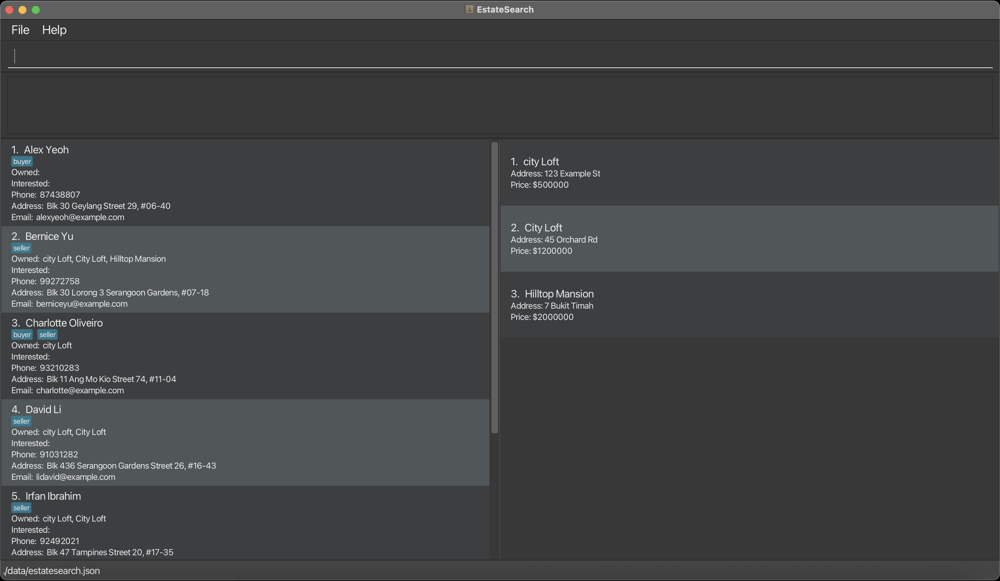

  ---

5. Type a command in the command box and press the <kbd>ENTER</kbd> key to execute it. e.g. typing **`help`** and pressing the <kbd>ENTER</kbd> key will open the help window. 
   Some example commands you can try:

   - `list` : Lists all contacts.

    * `add n/Edward Lim p/98765432 e/edwardl@gmail.com a/John street, block 123, #01-01` : Adds a client named `Edward Lim` to EstateSearch.

    * `delete 3` : Deletes the 3rd client shown in the current list.

    * `clear` : Deletes all clients and properties

   - `exit` : Exits the app.

6. Refer to the [Features](#features) below for details of each command.

<box type="tip">

**Tip**: When you first open EstateSearch, you will see that the application is populated with sample data. Feel free to test
out the features on the sample data to get comfortable with the app and its functions. Once you are ready to start
adding your own data, type in the <code>clear</code> command and press <kbd>ENTER</kbd>to reset all the client and
property data.
</box>

---

## EstateSearch Command Summary

| Action                                                                                     | Format, Examples                                                                                                                                                      |
|--------------------------------------------------------------------------------------------|-----------------------------------------------------------------------------------------------------------------------------------------------------------------------|
| [**General Utilities**](#general-utilities)                                                |                                                                                                                                                                       |
| [**Help**](#viewing-help--help)                                                            | `help`                                                                                                                                                                |
| [**Export**](#exporting-data--export)                                                      | `export FILENAME` e.g. export transfer_file                                                                                                                        |
| [**Clear**](#clearing-all-entries--clear)                                                  | `clear`                                                                                                                                                               |
| [**Exit**](#exiting-the-program--exit)                                                     | `exit`                                                                                                                                                                |
| [**Managing Clients**](#managing-clients)                                                  |                                                                                                                                                                       |
| [**Add**](#adding-a-client-add)                                                            | `add n/NAME p/PHONE_NUMBER e/EMAIL a/ADDRESS [t/TAG]…​`   e.g., `add n/James Ho p/22224444 e/jamesho@example.com a/123, Clementi Rd, 1234665 t/client t/colleague` |
| [**Delete**](#deleting-a-client--delete)                                                   | `delete INDEX`  e.g., `delete 3` `delete e/samantha123@gmail.com`                                                                                                  |
| [**Edit**](#editing-a-client--edit)                                                        | `edit INDEX [n/NAME] [p/PHONE_NUMBER] [e/EMAIL] [a/ADDRESS] [t/TAG]…​`  e.g.,`edit 2 n/James Lee e/jameslee@example.com`                                           |
| [**Find**](#locating-clients-by-name-find)                                                 | `find n/NAME` or `find t/TAG`   e.g., `find n/James` `find t/client`                                                                                               |
| [**List**](#listing-all-clients--list)                                                     | `list`                                                                                                                                                                |
| [**Managing Properties**](#managing-properties)                                            |                                                                                                                                                                       |
| [**Add Property**](#adding-a-property-addp)                                                | `addp n/NAME a/ADDRESS pr/PRICE`   e.g., `addp n/Sunshine Condo a/123, Sunshine Rd, 123456 pr/800000`                                                              |
| [**Delete Property**](#deleting-a-property--deletep)                                       | `deletep INDEX`  e.g., ``delete`p 3`                                                                                                                               |
| [**Edit Property**](#editing-a-property--editp)                                            | `editp INDEX [n/NAME] [a/ADDRESS] [pr/PRICE]…​`  e.g.,`editp 2 n/Sunshine Condo pr/120000 a/123 Testing Rd`                                                        |
| [**Find Property**](#locating-properties-by-property-name-findp)                           | `findp n/PROPERTY`   e.g., `findp n/Sunshine Condo`                                                                                                                |
| [**List Property**](#listing-all-properties--listp)                                        | `listp`                                                                                                                                                               |
| [**Managing Client-Property relationships**](#managing-client-property-relationships)      |                                                                                                                                                                       |
| [**Set Owned Property**](#setting-an-owned-property-for-a-client--setop)                   | `setop INDEX n/PROPERTY_NAME`  e.g., `setop 1 n/City Loft`                                                                                                         |
| [**Set Interested Property**](#setting-an-interested-property-for-a-client--setip)         | `setip INDEX n/PROPERTY_NAME`  e.g., `setip 2 n/Sunshine Condo`                                                                                                    |
| [**Delete Owned Property**](#deleting-an-owned-property-from-a-client--deleteop)           | `deleteop INDEX n/PROPERTY_NAME`   e.g., `deleteop 1 n/Cinnamon Height`                                                                                            |
| [**Delete Interested Property**](#deleting-an-interested-property-from-a-client--deleteip) | `deleteip INDEX n/PROPERTY_NAME`   e.g., `deleteip 2 n/Sunshine Garden`                                                                                            |
---

## Features

<box type="info">

**Notes about the command format:** 

- Words in `UPPER_CASE` are the parameters to be supplied by the user. 
  e.g. in `add n/NAME`, `NAME` is a parameter which can be used as `add n/John Doe`.

- Items in square brackets are optional. 
  e.g. `n/NAME [t/TAG]` can be used as `n/John Doe t/friend` or as `n/John Doe`.

- Items with `…`​ after them can be used multiple times including zero times. 
  e.g. `[t/TAG]…​` can be used as ` ` (i.e. 0 times), `t/friend`, `t/friend t/family` etc.

- Parameters can be in any order. 
  e.g. if the command specifies `n/NAME p/PHONE_NUMBER`, `p/PHONE_NUMBER n/NAME` is also acceptable.

- Extraneous parameters for commands that do not take in parameters (such as `help`, `list`, `listp`, `exit`, `export`, and `clear`) will be ignored. 
  e.g. if the command specifies `help 123`, it will be interpreted as `help`.

- Spaces before and after parameter inputs will be stripped before they are processed. e.g. If the input for the name parameter is `n/ Adam`,
  the name that is used after the command executes is `Adam` with the front whitespace stripped

- If you are using a PDF version of this document, be careful when copying and pasting commands that span multiple lines as space characters surrounding line-breaks may be omitted when copied over to the application.
  </box>

## General Utilities

### Viewing help : `help`

Shows a brief overview of the commands that are available as well as a link to the user guide page.

Format: `help`

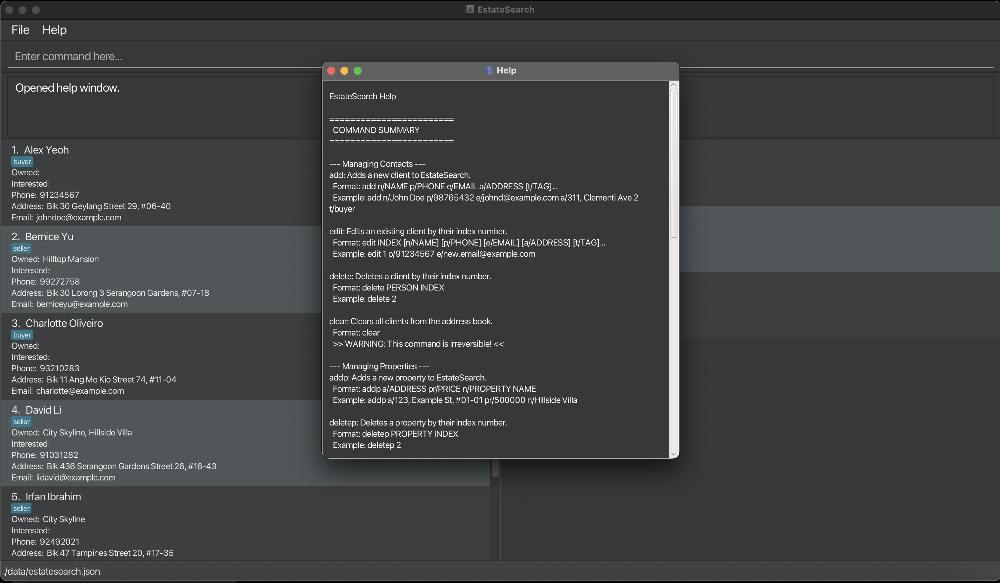

<box type="info">

**Note:** The help menu will be opened in a separate window. You can close the help window without exiting the application.

</box>

### Exporting data : `export`

Exports the current filtered contacts to a CSV file

<box type="warning">

**Caution:**
If a file with the same filename already exists in the data folder, it will be overwritten without confirmation.
</box>

Format: `export FILENAME`

- Exports all contacts currently shown in the filtered list to a CSV file.
- The CSV file is automatically saved with a .csv extension
- The FILENAME must not be empty and cannot contain only whitespace.

Examples:

- `export clients` creates a file named `clients.csv`
- `export my_contacts` creates a file named `my_contacts.csv`

<box type="tip">

**Tip**:
The generated CSV file can be found at `[JAR file location]/data/[EXPORT_FILENAME].csv`. 

</box>

### Clearing all entries : `clear`

Clears all entries of clients and properties from EstateSearch.

Format: `clear`

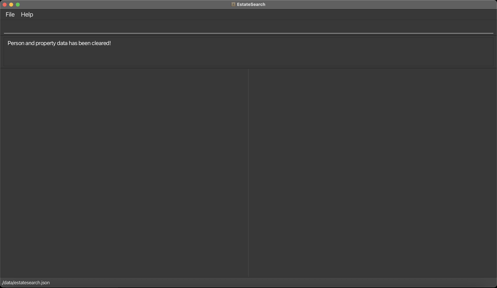
*Result from using the command `clear`*

<box type="warning">

**Caution:**
Clearing the data will delete all client and property entries permanently. There is no undo for this operation. 
Please execute this command only if you are sure you want to delete all data.
</box>

### Exiting the program : `exit`

Exits the program.

Format: `exit`

## Managing clients

This section contains the features that will allow you to manage your clients in EstateSearch.
EstateSearch will enable you to keep track of all your clients' important information such as their contact details,
address, and list of interested and owned properties. You can also add short custom tags for each client to
classify them and allow for filtering of search results.

### Adding a client: `add`

Adds a client to EstateSearch.

Format: `add n/NAME p/PHONE_NUMBER e/EMAIL a/ADDRESS [t/TAG]…​`

<box type="tip">

**Tip:** A client can have any number of tags (0 or more)
</box>

Examples:

- `add n/John Doe p/98765432 e/johnd@example.com a/John street, block 123, #01-01`
- `add n/Betsy Crowe t/client e/betsycrowe@example.com a/Changi p/1234567 t/buyer`

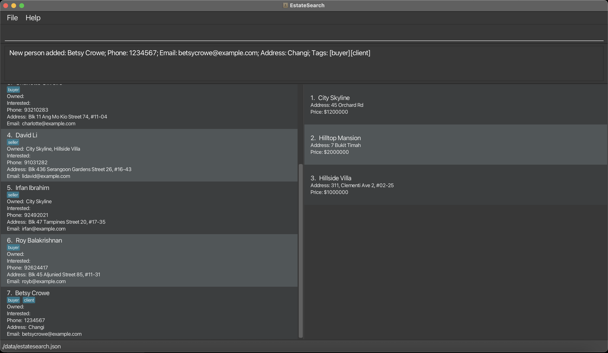
*Result from using the command `add n/Betsy Crowe t/client e/betsycrowe@example.com a/Changi p/1234567 t/buyer`*

### Deleting a client : `delete`

Deletes the specified client from EstateSearch.
<box type="warning">

**Caution:**
Deleting a client is permanent and cannot be undone. All associated owned and interested property relationships will also be removed.
</box>

Format: `delete INDEX` or `delete e/EMAIL`

- In the case where both an `EMAIL` and `INDEX` is specified, the `EMAIL` parameter will take precedence over the `INDEX`, and the client with the specified `EMAIL` will be deleted while the `INDEX` parameter will be ignored. This precedence remains true even if the `INDEX` is the first parameter.
  For example, `delete 2 e/random@gmail.com` will delete the client with the email matching `random@gmail.com` and ignore the `INDEX` parameter.
- If only an INDEX is specified, deletes the client at the specified `INDEX`
- If only an EMAIL is specified, deletes the client with a matching `EMAIL`
- The index refers to the index number shown in the current displayed client list
- The index **must be a positive integer** 1, 2, 3, …​

Examples:

- `list` followed by `delete 2` deletes the 2nd client in EstateSearch.
- `find n/Betsy` followed by `delete 1` deletes the 1st client in the results of the `find` command.

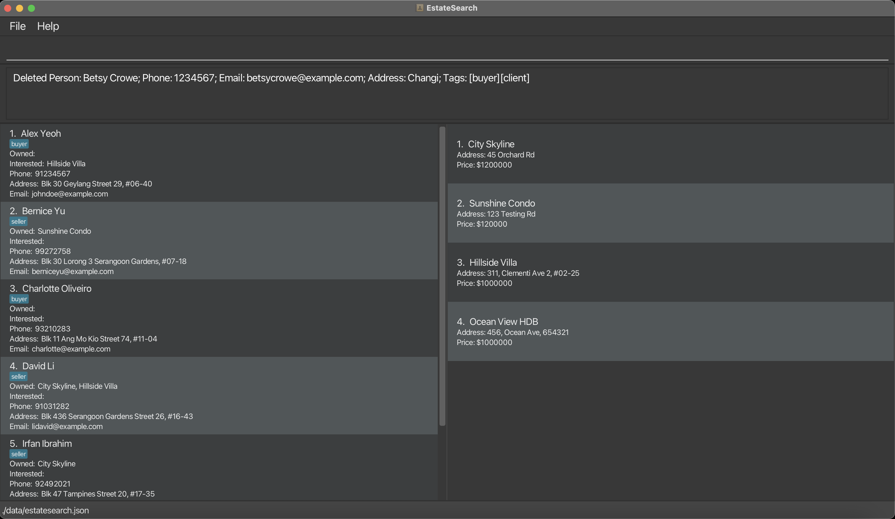
*Result from using the command `delete 7` where Betsy Crowe was the 7th client in the client list*

<box type="info">

**Info**:
* The delete command operates on the clients on the list that is currently displayed. For example, using the command `find n/John` followed by `delete 1` will delete the first client in the list returned by the `find` command and not from the entire list of clients.
  </box>

### Editing a client : `edit`

Edits an existing client in EstateSearch.

Format: `edit INDEX [n/NAME] [p/PHONE] [e/EMAIL] [a/ADDRESS] [t/TAG]…​`

- Edits the client at the specified `INDEX`. The index refers to the index number shown in the displayed client list. The index **must be a positive integer** 1, 2, 3, …​
- At least one of the optional fields must be provided.
- Existing values will be updated to the input values.
- When editing tags, all existing tags are replaced with your new tags. To keep existing tags, you must re-enter them along with any new tags.
- You can remove all the client’s tags by typing `t/` without
  specifying any tags after it.

Examples:

- `edit 1 p/91234567 e/johndoe@example.com` Edits the phone number and email address of the 1st client to be `91234567` and `johndoe@example.com` respectively.
- `edit 2 n/Betsy Crower t/` Edits the name of the 2nd client to be `Betsy Crower` and clears all existing tags.

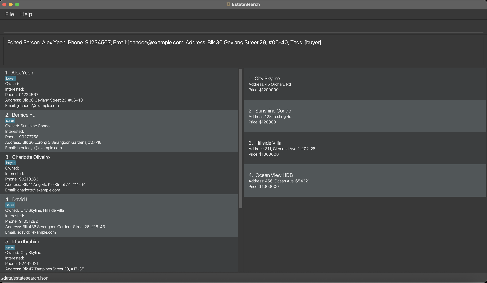
*Result from using the command `edit 1 n/Alex Yeoh p/91234567`*

### Locating clients by name: `find`

Finds contacts by either name or tag criteria.

Format: `find n/NAME or find t/TAG`

- The search is case-insensitive. e.g. `hans` will match `Hans`
- The order of the keywords does not matter. e.g. `Hans Bo` will match `Bo Hans`
- Only the name or tag parameter is searched.
- Substring matching will be used e.g. `Han` will match `Hans` and `Hannah`
- Clients matching at least one keyword will be returned (i.e. `OR` search).
  e.g. `Hans Bo` will return `Hans Gruber`, `Bo Yang`
- Examples:
- `find t/client` returns all contacts tagged as clients
- `find n/John` returns all contacts whose names contain `John` (case-insensitive)

Examples:

- `find n/John` returns `john` and `John Doe`
- `find t/buyer` returns clients who have the tag `buyer`  

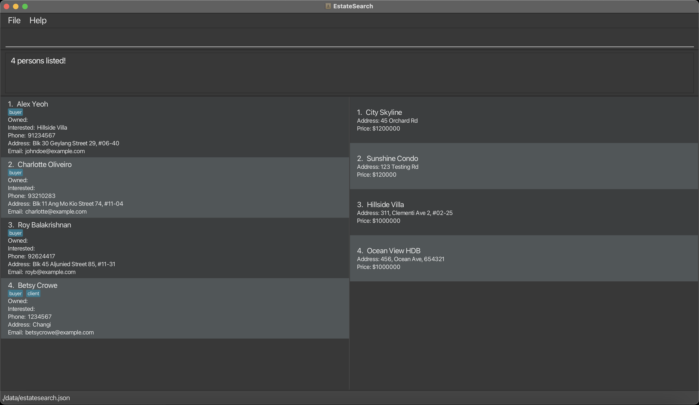
*Result from using the command `find t/buyer`*

### Listing all clients : `list`

Shows a list of all clients in EstateSearch.

Format: `list`

*Result from using the command `list`*

## Managing Properties
This section contains the features and commands that will allow you to manage your property portfolio in EstateSearch.
You will be able to keep track of your properties' important information such as their address, name, and price.

### Adding a property: `addp`

Adds a property to EstateSearch.

Format: `addp n/NAME a/ADDRESS pr/PRICE`

- Prices can only be input as integers with no decimal points. For example, `pr/800000` is valid while `pr/800000.50` is not valid.

Examples:

- `addp n/Sunshine Condo a/123, Sunshine Rd, 123456 pr/800000`
- `addp n/Ocean View HDB a/456, Ocean Ave, 654321 pr/1000000`

*Result from using the command `addp n/Ocean View HDB a/456, Ocean Ave, 654321 pr/1000000`*

### Deleting a property : `deletep`

Deletes the specified property from EstateSearch.
<box type="warning">

**Caution:**
Deleting a property will permanently remove it from EstateSearch and clear all ownership and interest relationships with clients. This action cannot be undone.
</box>

Format: `deletep INDEX`

- Deletes the property at the specified `INDEX`.
- The index refers to the index number shown in the current displayed property list.
- The index **must be a positive integer** 1, 2, 3, …​
- only 1 index parameter is allowed.

Examples:

- `deletep 2` deletes the 2nd property in the current displayed property list.

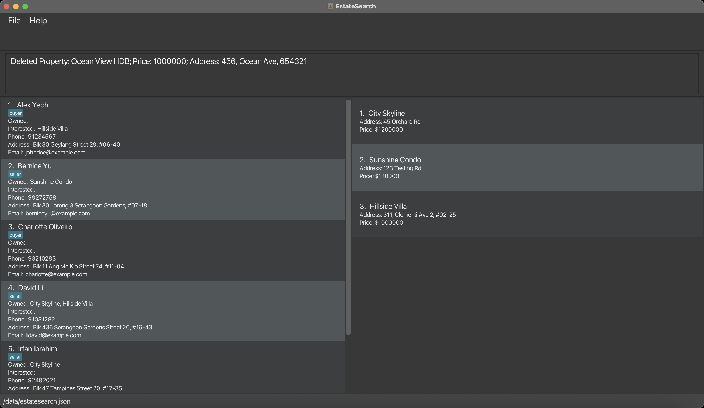
*Result from using the command `deletep 2` where Ocean View HDB was the second property in the displayed property list*

<box type="info">

**Info**:
* The delete command operates on the clients on the list that is currently displayed. For example, using the command `find n/John` followed by `delete 1` will delete the first client in the list returned by the `find` command and not from the entire list of clients.
  </box>

### Editing a property : `editp`

Edits an existing property in EstateSearch.

Format: `editp INDEX [n/NAME] [a/ADDRESS] [pr/PRICE]…`

- Edits the property at the specified `INDEX`. `INDEX` here refers to the index number shown in the displayed property list. `INDEX` **must be a positive integer** 1, 2, 3, …​
- At least one of the optional fields must be provided.
- Existing values will be updated to the input values.

Examples:

- `editp 2 n/Sunshine Condo pr/120000 a/ 123 Testing Rd` Edits the property name, price and address to be `Sunshine Condo`, `120000` and `123 Testing Rd` respectively

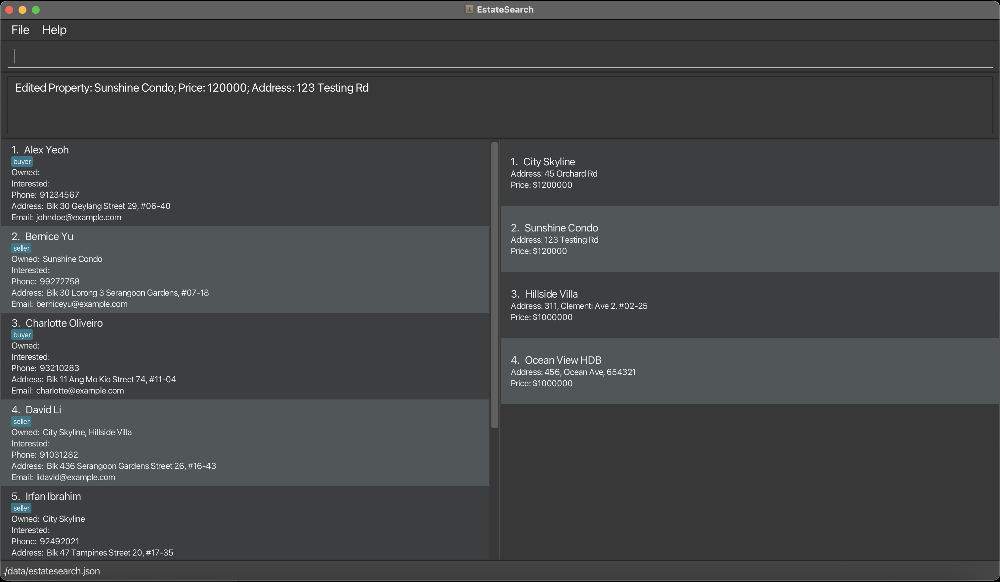
*Result from using the command `editp 2 n/Sunshine Condo a/123 Testing Rd pr/1000000`*

### Locating properties by property name: `findp`

Finds properties by property name.

Format: `findp n/PROPERTY NAME`

- The search is case-insensitive. e.g. `Sunshine` will match `sunshine`
- The order of the keywords does not matter. e.g. `Sunshine Lodge` will match `Lodge Sunshine`
- Only the property name is searched.
- findp uses substring matching for keywords. e.g. `Sun` matches `Sunflower Mansion` and `Sunshine Lodge`
- Properties matching at least one keyword will be returned (i.e. `OR` search).
  e.g. `Sunshine Lodge` will return `Sunshine Home`, `Lodge Farm`
- `findp n/Sunshine` returns all properties whose property names contain `sunshine` (case-insensitive)

Examples:

- `findp n/Sunshine` returns `sunshine` and `Sunshine Lodge`

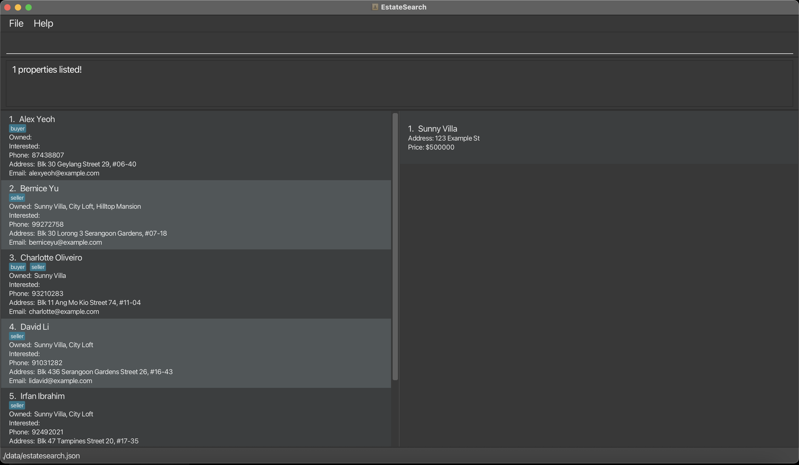
*Result from using the command `findp n/Sunshine`*

### Listing all properties : `listp`

Shows a list of all properties in EstateSearch.

Format: `listp`

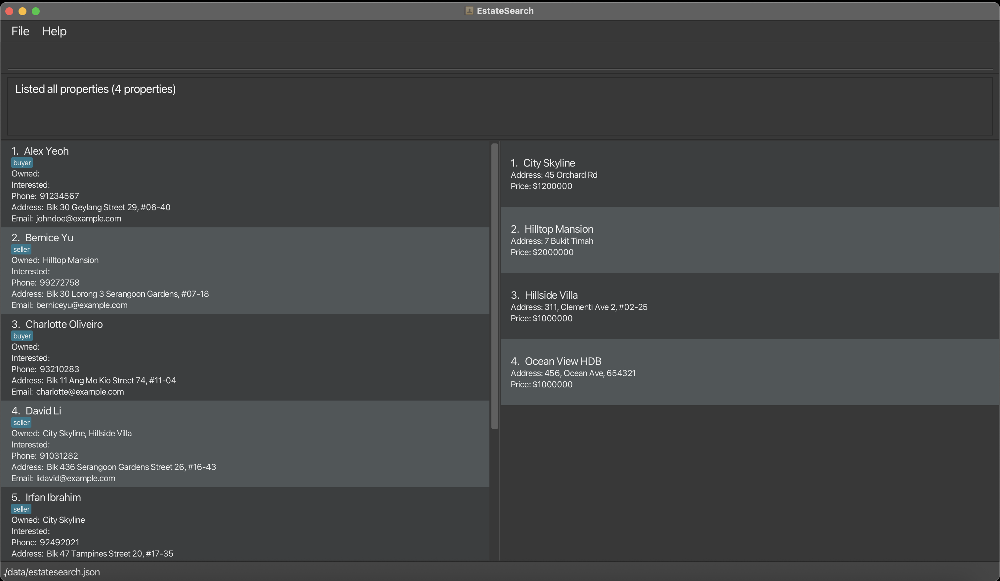
*Result from using the command `listp`*

## Managing client-property relationships
With EstateSearch, you can efficiently manage and visualize the relationships between your clients and properties.
You will be able to record which properties a client owns and which ones they are interested in, giving you a complete
overview of each client’s portfolio and preferences. With these features, you will be able to identify potential matches
between clients and properties and streamline client meetings with up-to-date insights.

### Setting an owned Property for a client : `setop`

Associates an existing property with the specified client as one of their owned properties.

Format: `setop INDEX_OF_CLIENT n/PROPERTY_NAME`

- Sets the owned property for the client at the specified `INDEX`. `INDEX` here refers to the index number shown in the displayed client list. `INDEX` **must be a positive integer** 1, 2, 3, …​
- `PROPERTY_NAME` must match the name of a property that already exists in the app.
- The specified client must not already own a property with the exact same `PROPERTY_NAME`
- If the given property name does not exist, an error message will be shown (e.g., Property not found: Marina Bay Apt 12F).
- Repeating the command with the same property for the same client will throw an error (e.g. This person already owns the property: PROPERTY_NAME)
- The property name matching is case-insensitive (e.g., Sunny Villa and sunny villa are considered the same).

Examples:

- 'setop 1 n/Marina Bay Apt 12F' — adds **Marina Bay Apt 12F** to the 1st client’s owned properties.
- list followed by 'setop 3 n/Choa Chu Kang Landed Property' — adds **Choa Chu Kang Landed Property** to the 3rd client’s owned properties.
  
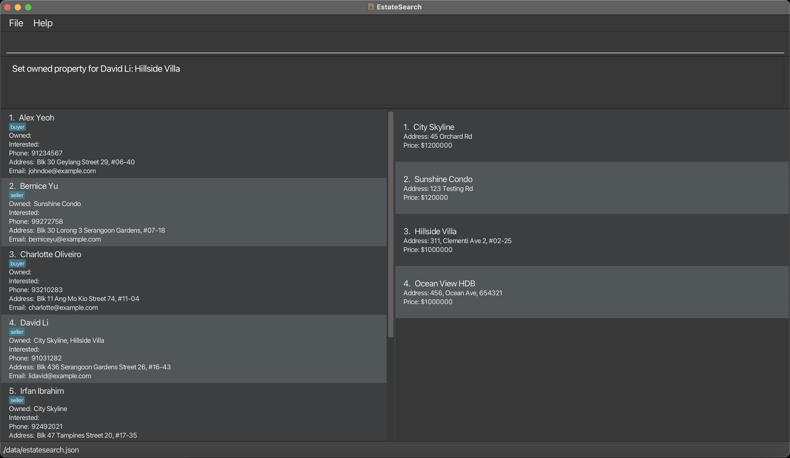
*Result from using the command `setop 4 n/Hillside Villa`*

<box type="info">

**Info**:
* Multiple people can own the same property.
* The setop command operates on the clients in the list that is currently displayed. 
For example, using the command `find n/John` followed by `setop 2 n/Valor House` will add `Valor House` to the owned properties list of the second client returned by the `find n/John` command
</box>

### Setting an interested property for a client : `setip`

Associates an existing property with the specified client as one of their interested properties.

Format: `setip INDEX_OF_CLIENT n/PROPERTY_NAME`

- Sets the interested property for the client at the specified `INDEX`. `INDEX` here refers to the index number shown in the displayed client list. `INDEX` **must be a positive integer** 1, 2, 3, …​
- `PROPERTY_NAME` must match the name of a property that already exists in the app
- The specified client must not already be interested in a property with the exact same `PROPERTY_NAME`
- If the given property name does not exist, an error message will be shown (e.g., Property not found: Marina Bay Apt 12F)
- Repeating the command with the same property for the same client will throw an error (e.g. This person is already marked as interested in this property: PROPERTY_NAME)
- The property name matching is case-insensitive (e.g., Sunny Villa and sunny villa are considered the same).

Examples:

- `setip 2 n/Sunshine Condo` — adds **Sunshine Condo** to the 2nd client’s interested properties
- list followed by `setip 4 n/Ocean View HDB` — adds **Ocean View** to the 4th client’s interested properties
 

<box type="info">

**Info**:
* Multiple people can be interested in the same property
* The setip command operates on the clients in the list that is currently displayed. 
For example, using the command `find n/John` followed by `setip 1 n/Valor House` will add `Valor House` to the interested properties list of the first client returned by the `find n/John` command
</box>

### Deleting an owned property from a client : `deleteop`

Removes an existing property from the specified client's list of owned properties.

Format: `deleteop INDEX_OF_CLIENT n/PROPERTY_NAME`

- Removes the owned property from the client at the specified `INDEX`. `INDEX` refers to the index number displayed in the client list currently. `INDEX` **must be a positive integer** 1, 2, 3, …​
- `PROPERTY_NAME` must match the name of a property that already exists in the app
- The specified client must already own a property with the exact same `PROPERTY_NAME`, otherwise an error message will be shown
- If the given property name does not exist, an error message will be shown (e.g., Property not found: Marina Bay Apt 12F)
- The property name matching is case-insensitive (e.g., Sunny Villa and sunny villa are considered the same).

Examples:

- `deleteop 2 n/City Loft` - removes **City Loft** from the 2nd client's list of owned properties
- list followed by `deleteop 4 n/Ocean View HDB` — removes **Ocean View** from the 4th client’s list of owned properties

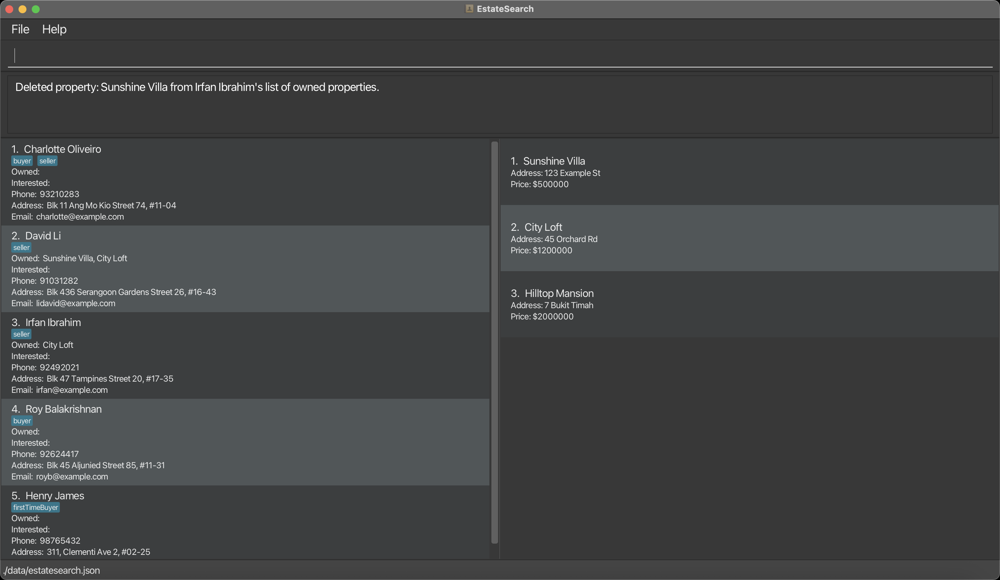

<box type="info">

**Info**: The deleteop command operates on the clients in the list that is currently displayed.
  For example, using the command `find n/John` followed by `deleteop 1 n/Valor House` will remove `Valor House` from the owned properties list of the first client returned by the `find n/John` command.
  </box>

### Deleting an interested property from a client : `deleteip`

Removes an existing property from the specified client's list of interested properties.

Format: `deleteip INDEX_OF_CLIENT n/PROPERTY_NAME`

- Removes the interested property from the client at the specified `INDEX`. `INDEX` refers to the index number displayed in the client list currently. `INDEX` **must be a positive integer** 1, 2, 3, …​
- `PROPERTY_NAME` must match the name of a property that already exists in the app
- The specified client must already be interested in a property with the exact same `PROPERTY_NAME`, otherwise an error will be shown
- If the given property name does not exist, an error message will be shown (e.g., Property not found: Marina Bay Apt 12F)
- The property name matching is case-insensitive (e.g., Sunny Villa and sunny villa are considered the same).

Examples:

- `deleteip 2 n/City Loft` - removes **City Loft** from the 2nd client's list of interested properties
- list followed by `deleteip 4 n/Ocean View HDB` — removes **Ocean View** from the 4th client’s list of interested properties

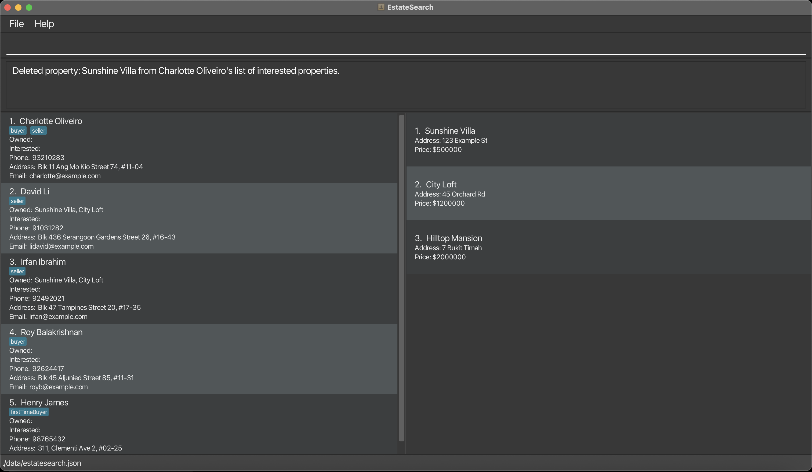

<box type="info">

**Info**:
* The deleteip command operates on the clients in the list that is currently displayed. 
For example, using the command `find n/John` followed by `deleteip 1 n/Valor House` will remove `Valor House` from the interested properties list of the first client returned by the `find n/John` command.
  </box>

### Saving the data

EstateSearch data are saved in the hard disk automatically after any command that changes the data. There is no need to save manually.

### Editing the data file

EstateSearch data are saved automatically as a JSON file located at`[JAR file location]/data/estatesearch.json`. Advanced users are welcome to update data directly by editing that data file.

<box type="info">

**Info**:
The client data is stored as json objects under the `person` field.
</box>

<box type="warning">

**Caution:**
If your changes to the data file makes its format invalid, EstateSearch will discard all data and start with an empty data file at the next run. Hence, it is recommended to take a backup of the file before editing it. 
Furthermore, certain edits can cause EstateSearch to behave in unexpected ways (e.g., if a value entered is outside the acceptable range). Therefore, edit the data file only if you are confident that you can update it correctly.
If there are any entries with invalid values, EstateSearch will ignore those entries when loading the data file, and a popup will inform you about the number of ignored entries and the reasons for their invalidity.

</box>

---

## FAQ

**Q**: How do I transfer my data to another Computer? 
**A**: Install the app in the other computer and overwrite the empty data file it creates with the file that
contains the data of your previous EstateSearch home folder.

**Q**: Can I search for partial names like 'John' for 'Johnathan' 
**A**: EstateSearch does support partial name matching. For example, searching for 'John' will match 'John Doe' and 'Johnathan Smith'.

**Q**: Does each client or property have a fixed index? 
**A**: No. The index of each client and property depends on the current filtered list showed in the GUI.
The index may change when the list is filtered using the `find` command or when a client or a property is deleted. 

**Q**: Do I need any prior programming knowledge to use EstateSearch? 
**A**: EstateSearch does not require any prior programming knowledge 

**Q**: Which operating systems can EstateSearch run on? 
**A**: EstateSearch can run on Windows, macOS, and Linux, as long as Java `17` is installed and used. 

**Q**: How are duplicates determined for clients and properties? 
**A**: Clients are considered duplicates if they have the same, <code>NAME</code>, <code>PHONE</code>,
<code>EMAIL</code>, and <code>ADDRESS</code> field. Properties are considered duplicates if they have the
same <code>PROPERTY NAME</code> 

**Q**: Does each client have a fixed index? 
**A**: No. The index of each client depends on the current filtered list showed in the GUI. The index of a client may change when the list is filtered using the `find` command or when clients are added or deleted.

---

## Known issues

1. **When using multiple screens**, if you move the application to a secondary screen, and later switch to using only
   the primary screen, the GUI will open off-screen. The remedy is to delete the `preferences.json` file created by
   the application before running the application again.
2. **If you minimize the Help Window** and then run the `help` command (or use the `Help` menu, or the keyboard
   shortcut `F1`) again, the original Help Window will remain minimized, and no new Help Window will appear.
   The remedy is to manually restore the minimized Help Window.

---

## Acceptable Value Ranges for Parameters

| Command                          | Parameters & Acceptable Inputs                                                                                                                                                                                                                                                                                                                                                                                                                                                                                                                                                                                                                                                                                                                                                                                                                                                                                                                                                                                                                                                                                                                                                                     |
|----------------------------------|----------------------------------------------------------------------------------------------------------------------------------------------------------------------------------------------------------------------------------------------------------------------------------------------------------------------------------------------------------------------------------------------------------------------------------------------------------------------------------------------------------------------------------------------------------------------------------------------------------------------------------------------------------------------------------------------------------------------------------------------------------------------------------------------------------------------------------------------------------------------------------------------------------------------------------------------------------------------------------------------------------------------------------------------------------------------------------------------------------------------------------------------------------------------------------------------------|
| **General Utilities**            |                                                                                                                                                                                                                                                                                                                                                                                                                                                                                                                                                                                                                                                                                                                                                                                                                                                                                                                                                                                                                                                                                                                                                                                                    |
| help                             | No parameters required                                                                                                                                                                                                                                                                                                                                                                                                                                                                                                                                                                                                                                                                                                                                                                                                                                                                                                                                                                                                                                                                                                                                                                             |
| export                           | **File Name**: Should only contain alphanumeric characters, `-` or `_`, with no spaces between words and should not be blank                                                                                                                                                                                                                                                                                                                                                                                                                                                                                                                                                                                                                                                                                                                                                                                                                                                                                                                                                                                                                                                                       |
| clear                            | No parameters required                                                                                                                                                                                                                                                                                                                                                                                                                                                                                                                                                                                                                                                                                                                                                                                                                                                                                                                                                                                                                                                                                                                                                                             |
| exit                             | No parameters required                                                                                                                                                                                                                                                                                                                                                                                                                                                                                                                                                                                                                                                                                                                                                                                                                                                                                                                                                                                                                                                                                                                                                                             |
| **Managing Clients**             |                                                                                                                                                                                                                                                                                                                                                                                                                                                                                                                                                                                                                                                                                                                                                                                                                                                                                                                                                                                                                                                                                                                                                                                                    |
| add                              | **Name**: Up to 50 alphanumeric characters, spaces and the following special characters: `@`, `,` and `-`. Should not be blank **Phone**: Numbers, at least 3 digits and at most 20 digits long **Email**: Emails should be of the format local-part@domain and adhere to the following constraints: • The local-part should only contain alphanumeric characters and these special characters, excluding the parentheses, (+_.-). The local-part may not start or end with any special characters. • This is followed by a '@' and then a domain name. The domain name is made up of domain labels separated by periods. • The domain name must end with a domain label at least 2 characters long, have each domain label start and end with alphanumeric characters, and have each domain label consist of alphanumeric characters, separated only by hyphens, if any. • Special characters (+_.-) can only be used to separate alphanumeric values and not be put together consecutively. **Address**: Can take any value, should not be blank **Tag**: Tags should only contain up to 30 alphanumeric characters with no spaces between words. Tags can be left empty |
| delete                           | **Index**: Positive integers only. • Integers less than 1 will cause an invalid command format error. • Integers greater than the number of clients displayed in the given mode are invalid.  **Email**: Refer to Managing Clients > add > Email                                                                                                                                                                                                                                                                                                                                                                                                                                                                                                                                                                                                                                                                                                                                                                                                                                                                                                                                          |
| edit                             | **Index**: Refer to Managing Clients > delete > Index **Remaining parameters**: Refer to Managing Clients > add                                                                                                                                                                                                                                                                                                                                                                                                                                                                                                                                                                                                                                                                                                                                                                                                                                                                                                                                                                                                                                                                                 |
| find                             | **Name**: Refer to Managing Clients > Add > Name **Tag**: Refer to Managing Clients > Add > Tag                                                                                                                                                                                                                                                                                                                                                                                                                                                                                                                                                                                                                                                                                                                                                                                                                                                                                                                                                                                                                                                                                                 |
| list                             | No parameters required                                                                                                                                                                                                                                                                                                                                                                                                                                                                                                                                                                                                                                                                                                                                                                                                                                                                                                                                                                                                                                                                                                                                                                             |
| **Managing Properties**          |                                                                                                                                                                                                                                                                                                                                                                                                                                                                                                                                                                                                                                                                                                                                                                                                                                                                                                                                                                                                                                                                                                                                                                                                    |
| addp                             | **Address**: Refer to Managing Client > add > Address **Price**: Can only take positive numbers less than 2147483647 and should be a singular integer with no commas or decimal points **Property Name**: Refer to Managing Clients > Add > Name                                                                                                                                                                                                                                                                                                                                                                                                                                                                                                                                                                                                                                                                                                                                                                                                                                                                                                                                             |
| deletep                          | **Index**: Refer to Managing Clients > delete > Index                                                                                                                                                                                                                                                                                                                                                                                                                                                                                                                                                                                                                                                                                                                                                                                                                                                                                                                                                                                                                                                                                                                                              |
| editp                            | **Index**: Refer to Managing Clients > delete > Index **Remaining parameters**: Refer to Managing Properties > addp                                                                                                                                                                                                                                                                                                                                                                                                                                                                                                                                                                                                                                                                                                                                                                                                                                                                                                                                                                                                                                                                             |
| findp                            | **Property Name**: Refer to Managing Client > add > Name                                                                                                                                                                                                                                                                                                                                                                                                                                                                                                                                                                                                                                                                                                                                                                                                                                                                                                                                                                                                                                                                                                                                           |
| listp                            | No parameters required                                                                                                                                                                                                                                                                                                                                                                                                                                                                                                                                                                                                                                                                                                                                                                                                                                                                                                                                                                                                                                                                                                                                                                             |
| **Client-Property Relationship** |                                                                                                                                                                                                                                                                                                                                                                                                                                                                                                                                                                                                                                                                                                                                                                                                                                                                                                                                                                                                                                                                                                                                                                                                    |
| setop, setip                     | **Property Name**: Refer to Managing Clients > add > Name                                                                                                                                                                                                                                                                                                                                                                                                                                                                                                                                                                                                                                                                                                                                                                                                                                                                                                                                                                                                                                                                                                                                          |
| deleteop, deleteip               | **Property Name**: Refer to Managing Clients > add > Name                                                                                                                                                                                                                                                                                                                                                                                                                                                                                                                                                                                                                                                                                                                                                                                                                                                                                                                                                                                                                                                                                                                                          |

---
## Glossary

| Term                                | Meaning                                                                   |
|-------------------------------------|---------------------------------------------------------------------------|
| **CLI (Command-Line Interface)**    | Use the app by typing commands (e.g., `add …`).                           |
| **GUI (Graphical User Interface)**  | The visual window with lists, buttons, and panels.                        |
| **Command Box**                     | Text field where you enter commands; press <kbd>ENTER</kbd> to run.       |
| **Index**                           | 1-based position shown in the current list; changes with filtering.       |
| **Filtered List**                   | The list after `find`/`findp`; commands using indices refer to this list. |
| **Client**                          | A contact entry with Name, Phone, Email, Address, and Tags.               |
| **Property**                        | A real-estate entry with Property Name, Address, and Price.               |
| **Owned Properties**                | Properties a client owns; managed via `setop`.                            |
| **Interested Properties**           | Properties a client is interested in; managed via `setip`.                |
| **Tag**                             | Short label (e.g., `buyer`, `vip`) for grouping/filtering contacts.       |
| **Data File (`estatesearch.json`)** | The JSON storage file for clients and properties.                         |
